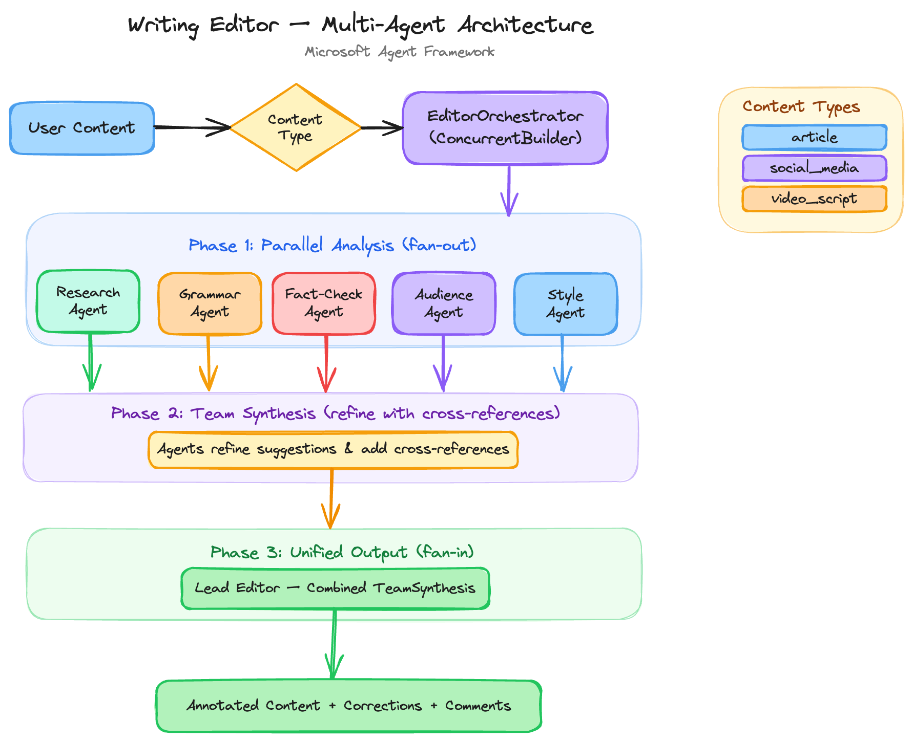

# Writing Editor - Multi-Agent AI Assistant

A collaborative multi-agent writing assistant powered by **Microsoft Agent Framework**, where five specialist agents work as a team—sharing insights and building on each other's findings—using LLM internal knowledge for research and fact-checking. Each agent adapts its analysis based on content type (article, social media, video script).

## Architecture



## Technology Stack

- **Microsoft Agent Framework** (`agent-framework-core`, `agent-framework-azure-ai`, `agent-framework-orchestrations`)
- **Azure OpenAI** for LLM backend
- **ConcurrentBuilder** for parallel fan-out/fan-in agent orchestration

## Agents

| Agent | Responsibility | Content-Type Adaptations |
|-------|----------------|-------------------------|
| **Research Agent** | Provides background context, related topics, supporting information using LLM knowledge | Deep context for articles, trending angles for social, talking points for video |
| **Grammar Agent** | Spelling, punctuation, sentence structure, readability | Strict for articles, relaxed for social media casual tone, spoken-word rules for video |
| **Fact-Check Agent** | Identifies claims, assesses accuracy likelihood, flags statements needing external verification | Thorough for articles, lighter for opinion-based social posts |
| **Audience Agent** | Evaluates fit for target demographic, engagement potential | Depth for articles, hooks for social, pacing for video |
| **Style Agent** | Tone/voice consistency, style guide adherence | Professional for articles, conversational for social, energetic for video |

## Workflow

1. **Phase 1 - Parallel Analysis**: All agents analyze content simultaneously using ConcurrentBuilder (fan-out)
2. **Phase 2 - Team Synthesis**: Agents refine suggestions considering teammates' findings (fan-in/fan-out)
3. **Phase 3 - Unified Output**: Lead Editor agent synthesizes all recommendations

## Supported Content Types

- **article**: Strict grammar, thorough fact-check, formal style, depth-focused
- **social_media**: Casual grammar tolerance, engagement-focused, platform-aware
- **video_script**: Pacing analysis, hook timing, visual cues, spoken-word grammar

## Project Structure

```
writing-editor/
├── client.py                 # Interactive CLI
├── app.py                    # Flask web UI
├── requirements.txt          # Microsoft Agent Framework dependencies
├── .env                      # Azure OpenAI & observability configuration
├── README.md
│
├── src/
│   ├── __init__.py
│   ├── orchestrator.py       # EditorOrchestrator using ConcurrentBuilder
│   ├── observability.py      # OpenTelemetry & Azure Monitor integration
│   │
│   ├── agents/
│   │   ├── __init__.py
│   │   └── base.py           # Agent factory functions & AGENT_CONFIGS
│   │
│   └── models/
│       ├── __init__.py
│       ├── context.py        # EditingContext
│       └── results.py        # AgentResult, TeamSynthesis
│
├── templates/                # Flask HTML templates
│   ├── base.html
│   └── index.html
│
├── static/css/               # Flask static assets
│   └── style.css
│
└── config/
    └── content_types.json    # Content-type specific rules
```

## Setup

1. **Install dependencies**:
   ```bash
   pip install -r requirements.txt
   ```

2. **Configure Azure OpenAI** - Create a `.env` file:
   ```bash
   AZURE_OPENAI_ENDPOINT=https://your-resource.openai.azure.com/
   AZURE_OPENAI_CHAT_DEPLOYMENT_NAME=gpt-4o-mini
   # Optional: AZURE_OPENAI_API_KEY=your-api-key
   ```

3. **Authenticate** (if not using API key):
   ```bash
   az login
   ```

## Usage

### CLI Mode
```bash
python client.py
```

### Web UI Mode
```bash
python app.py
# Open http://localhost:5001
```

Paste your content, select type (article/social_media/video_script), and receive team-synthesized feedback.

## Observability & Tracing

The application includes comprehensive observability features powered by OpenTelemetry and Azure Monitor for Azure AI Foundry integration.

### Features

- **Distributed Tracing**: Full trace correlation across all workflow phases and agent invocations
- **Metrics Collection**: Agent duration, suggestion counts, phase timing
- **Evaluation Tracking**: Performance metrics, refinement improvement ratios
- **Azure AI Foundry Integration**: Native support for Foundry's tracing and evaluation features

### Configuration

Add observability configuration to your `.env` file:

```bash
# Azure AI Foundry (recommended for Foundry tracing)
AZURE_AI_PROJECT_ENDPOINT=https://your-project.services.ai.azure.com/api/projects/your-project

# OR: Application Insights (standalone Azure Monitor)
APPLICATIONINSIGHTS_CONNECTION_STRING=InstrumentationKey=xxx;...

# OR: OTLP endpoint (local development with Aspire Dashboard)
OTEL_EXPORTER_OTLP_ENDPOINT=http://localhost:4317

# Service identification
OTEL_SERVICE_NAME=writing-agent-editor
OTEL_SERVICE_VERSION=1.0.0
```

### Viewing Traces

| Backend | How to View |
|---------|-------------|
| **Azure AI Foundry** | Azure Portal → Azure AI Foundry → Operate → Tracing |
| **Application Insights** | Azure Portal → Application Insights → Transaction search |
| **Aspire Dashboard** | http://localhost:18888 (run `docker run -p 18888:18888 -p 4317:4317 mcr.microsoft.com/dotnet/aspire-dashboard:latest`) |

### Trace Structure

```
WritingAgentWorkflow (root span)
├── Phase 1: Independent Analysis
│   ├── Research Agent.analyze
│   ├── Grammar Agent.analyze
│   ├── Fact-Check Agent.analyze
│   ├── Audience Agent.analyze
│   └── Style Agent.analyze
├── Phase 2: Team Synthesis
│   ├── Research Agent.refine
│   ├── Grammar Agent.refine
│   ├── Fact-Check Agent.refine
│   ├── Audience Agent.refine
│   └── Style Agent.refine
└── Phase 3: Unified Summary
    └── Lead Editor.synthesize
```

### API Endpoints

| Endpoint | Description |
|----------|-------------|
| `GET /health` | Health check with observability status |
| `GET /traces` | Information about configured trace backends |
| `POST /analyze` | Analyze content (returns `trace_id` and `evaluation` metrics) |

## Notes

- Built on **Microsoft Agent Framework** for enterprise-grade multi-agent orchestration
- Uses **ConcurrentBuilder** for parallel fan-out/fan-in workflow patterns
- Uses LLM internal knowledge (no external API calls for research)
- Fact-Check Agent provides confidence levels and flags claims needing external verification
- Agents collaborate rather than override—suggestions show cross-agent connections
- **OpenTelemetry** integration for distributed tracing across all agents
- **Azure AI Foundry** native support for tracing and evaluation
